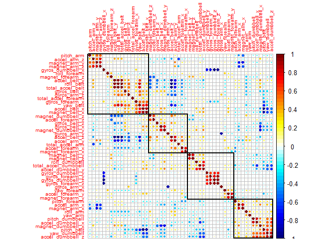
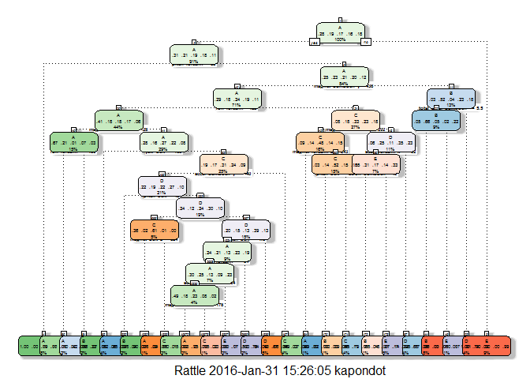
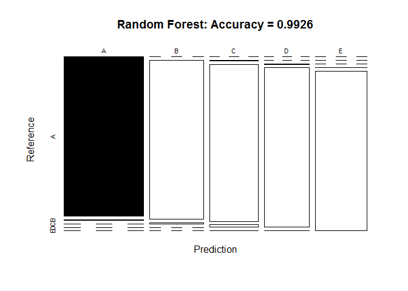
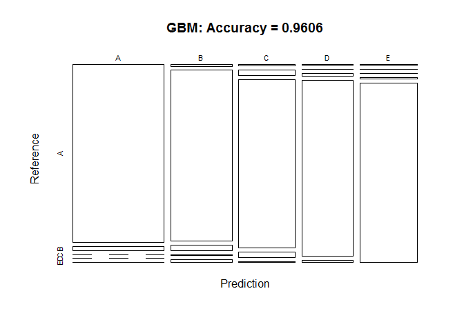

# Practical Machine Learning Final Project: Prediction with Classification
Tongesai Kapondo  
22 January 2016  

##<span style="color:#1a53ff">Introduction</span>

### Background

Majority of the attention in human activity recognition research focuses on discrimination between different types of activities, but not quality of the activities. In this study, the goal is to investigate how well an activity was performed by six wearers of electronic devices. They were asked to perform barbell lifts correctly and incorrectly in 5 different ways, namely

* __Class A:__ exactly according to the specification
* __Class B:__ throwing the elbows to the front
* __Class C:__ lifting the dumbbell only halfway
* __Class D:__ lowering the dumbbell only half way
* __Class E:__ throwing the hips to the front.

### Data Source

The data for this project is cited [here](http://groupware.les.inf.puc-rio.br/har).

The **training data** for this project are available here:
https://d396qusza40orc.cloudfront.net/predmachlearn/pml-training.csv

The **testing data** are available here:
https://d396qusza40orc.cloudfront.net/predmachlearn/pml-testing.csv

### Goal of Project

The goal of the project is to predict the manner in which the exercises were done. This is the **"classe"** variable in the training set. The created report describes how one builts a model, how to use cross validation, what one thinks the expected out of sample error is, and why you made the choices you did. There is also requirement to use your prediction model to predict 20 different test cases.

### Loading required libraries/packages


```r
library(pacman)
p_load("caret", "knitr", "randomForest", "rpart", "rpart.plot", "gbm", "rattle", "plyr", "ggplot2", "doParallel", "corrplot")
```


##<span style="color:#1a53ff">Getting and loading the data</span>


```r
set.seed(1234)

training.url <- "http://d396qusza40orc.cloudfront.net/predmachlearn/pml-training.csv"
testing.url <- "http://d396qusza40orc.cloudfront.net/predmachlearn/pml-testing.csv"

training <- read.csv(url(training.url), na.strings=c("NA","#DIV/0!",""))
testing <- read.csv(url(testing.url), na.strings=c("NA","#DIV/0!",""))
dim(training); dim(testing)
```

```
## [1] 19622   160
```

```
## [1]  20 160
```

The raw dataset contained **19622** rows of data, with **160** variables. Many variables contained largely missing data (usually with only one row of data), so these were removed from the dataset. In addition, variables not concerning the movement sensors were also removed.


##<span style="color:#1a53ff">Cleaning the data</span>

Remove variables that has more than 75% NAs.


```r
noNAs <- sapply(training, function(x) mean(is.na(x))) > 0.75
training <- training[, noNAs==FALSE]
noNAs <- sapply(testing, function(x) mean(is.na(x))) > 0.75
testing <- testing[, noNAs==FALSE]
dim(training); dim(testing)
```

```
## [1] 19622    60
```

```
## [1] 20 60
```

Removing first 5 ID variables so that it does not interfer with `ML` Algorithms:


```r
# remove identification only variables (columns 1 to 5)
training <- training[, -(1:5)]; testing <- testing[, -(1:5)]
dim(training); dim(testing)
```

```
## [1] 19622    55
```

```
## [1] 20 55
```
**Removing near zero variances**

Removing near zero variances using **`nearZeroVar`** function. `nearZeroVar` diagnoses predictors that have one unique value (i.e. are zero variance predictors) or predictors that are both of the following characteristics: they have very few unique values relative to the number of samples and the ratio of the frequency of the most common value to the frequency of the second most common value is large. `checkConditionalX` looks at the distribution of the columns of x conditioned on the levels of y and identifies columns of x that are sparse within groups of y.


```r
nzv <- nearZeroVar(training, saveMetrics=TRUE)
training <- training[,nzv$nzv==FALSE]

nzv<- nearZeroVar(testing,saveMetrics=TRUE)
testing <- testing[,nzv$nzv==FALSE]
dim(training); dim(testing)
```

```
## [1] 19622    54
```

```
## [1] 20 54
```

Removing first column referred to as **num_window** , which has nothing to do with the exercises .


```r
training <- training[c(-1)]; testing <- testing[c(-1)]
dim(training); dim(testing)
```

```
## [1] 19622    53
```

```
## [1] 20 53
```


After the cleaning process above, the number of variables for the analysis has been reduced to **53** only.

##<span style="color:#1a53ff">Partitioning the Data</span>

The dataset was partitioned into **training** and **testing** datasets, with `60%` of the original data going to the **training** set and `40%` to the **testing** set. The model was built with the **training dataset**, then tested on the **testing dataset**. The following code performs this procedure:


```r
inTrain <- createDataPartition(training$classe, p=0.6, list=FALSE)
myTraining <- training[inTrain, ]
myTesting <- training[-inTrain, ]
dim(myTraining); dim(myTesting)
```

```
## [1] 11776    53
```

```
## [1] 7846   53
```

## <span style="color:#1a53ff">Correlation</span>


```r
col1 <- colorRampPalette(c("#00007F" , "blue","#007FFF" , "cyan", "white",
                           "yellow", "#FF7F00", "red", "#7F0000"))
corMatrix <- cor(myTraining[, -53])
corrplot(corMatrix, order = "hclust", tl.cex =0.6,addrect =4, col = col1(50))
```



The highly correlated variables are shown in dark colors in the graph above. If using `"hclust"`, `corrplot()` can draw circles around the chart of correlation matrix based on the results of hierarchical clustering.


##<span style="color:#1a53ff">Model Predictions</span>

Many methods of classification were attempted, including **`Decision Trees`, `Random Forests`** and **`Generalized Boosted Regression (GBM)`**.

The R codes used are shown below, as are the confusion matrices. The `OOB` error rate in the training and the confusion matrix is shown below.

<br>

###<span style="color:#1a53ff">Prediction with Decision Trees</span> 


```r
set.seed(12345)
DTmodelFit <- rpart(classe ~ ., data=myTraining, method="class")
fancyRpartPlot(DTmodelFit, cex =0.4, ycompress =FALSE)
```

```
## Warning: labs do not fit even at cex 0.15, there may be some overplotting
```



### Prediction

```r
DTpredictions <- predict(DTmodelFit, myTesting, type = "class")
DeciTree <- confusionMatrix(DTpredictions, myTesting$classe)
DeciTree
```

```
## Confusion Matrix and Statistics
## 
##           Reference
## Prediction    A    B    C    D    E
##          A 1980  212   21   72   31
##          B   85  862   72   90   98
##          C   56  153 1086  209  175
##          D   71  101  110  823   89
##          E   40  190   79   92 1049
## 
## Overall Statistics
##                                           
##                Accuracy : 0.7392          
##                  95% CI : (0.7294, 0.7489)
##     No Information Rate : 0.2845          
##     P-Value [Acc > NIR] : < 2.2e-16       
##                                           
##                   Kappa : 0.6699          
##  Mcnemar's Test P-Value : < 2.2e-16       
## 
## Statistics by Class:
## 
##                      Class: A Class: B Class: C Class: D Class: E
## Sensitivity            0.8871   0.5679   0.7939   0.6400   0.7275
## Specificity            0.9401   0.9455   0.9085   0.9434   0.9374
## Pos Pred Value         0.8549   0.7142   0.6468   0.6893   0.7234
## Neg Pred Value         0.9544   0.9012   0.9543   0.9304   0.9386
## Prevalence             0.2845   0.1935   0.1744   0.1639   0.1838
## Detection Rate         0.2524   0.1099   0.1384   0.1049   0.1337
## Detection Prevalence   0.2952   0.1538   0.2140   0.1522   0.1848
## Balanced Accuracy      0.9136   0.7567   0.8512   0.7917   0.8324
```
The accuracy of predicting with trees is **0.7392** with **95% CI : (0.7294, 0.7489)**. 


###<span style="color:#1a53ff">Prediction with Random Forests</span> 


```r
set.seed(1777)
Random_Forest <- randomForest(classe ~. , data=myTraining)
RFpredictions <- predict(Random_Forest, myTesting, type = "class")
```

### Using Confusion Matrix to test results


```r
ConfMatRF <- confusionMatrix(RFpredictions, myTesting$classe); ConfMatRF
```

```
## Confusion Matrix and Statistics
## 
##           Reference
## Prediction    A    B    C    D    E
##          A 2232   12    0    0    0
##          B    0 1501   12    0    0
##          C    0    5 1353   20    2
##          D    0    0    3 1264    2
##          E    0    0    0    2 1438
## 
## Overall Statistics
##                                           
##                Accuracy : 0.9926          
##                  95% CI : (0.9905, 0.9944)
##     No Information Rate : 0.2845          
##     P-Value [Acc > NIR] : < 2.2e-16       
##                                           
##                   Kappa : 0.9906          
##  Mcnemar's Test P-Value : NA              
## 
## Statistics by Class:
## 
##                      Class: A Class: B Class: C Class: D Class: E
## Sensitivity            1.0000   0.9888   0.9890   0.9829   0.9972
## Specificity            0.9979   0.9981   0.9958   0.9992   0.9997
## Pos Pred Value         0.9947   0.9921   0.9804   0.9961   0.9986
## Neg Pred Value         1.0000   0.9973   0.9977   0.9967   0.9994
## Prevalence             0.2845   0.1935   0.1744   0.1639   0.1838
## Detection Rate         0.2845   0.1913   0.1724   0.1611   0.1833
## Detection Prevalence   0.2860   0.1928   0.1759   0.1617   0.1835
## Balanced Accuracy      0.9989   0.9935   0.9924   0.9911   0.9985
```

```r
# Plotting Matrix Results

plot(ConfMatRF$table, col = ConfMatRF$byClass, 
main = paste("Random Forest: Accuracy =",round(ConfMatRF$overall['Accuracy'], 4)))
```



The Random Forest Algorithm resulted in predictions with an accuracy of **0.9926** and **95% CI : (0.9905, 0.9944)**. This is a pretty good accuracy!


## <span style="color:#1a53ff">Cross-validation</span>

For purpose of cross-validation - **"cv"**, I partitioned the training set into a smaller set called smalltraining (30% of data) to speed up the running of the model


```r
InTrain<-createDataPartition(y=training$classe,p=0.30,list=FALSE)
smalltraining<-training[InTrain,]
```

Here I used the caret package with Random Forest as my model with 5 fold cross validation - **"cv"**


```r
RF_model_small<-train(classe~.,data=smalltraining,method="rf",
                trControl=trainControl(method="cv",number=5),
                prox=TRUE,doParallel=TRUE)
RF_model_small; RF_model_small$finalModel
```

```
## Random Forest 
## 
## 5889 samples
##   52 predictor
##    5 classes: 'A', 'B', 'C', 'D', 'E' 
## 
## No pre-processing
## Resampling: Cross-Validated (5 fold) 
## Summary of sample sizes: 4712, 4711, 4712, 4710, 4711 
## Resampling results across tuning parameters:
## 
##   mtry  Accuracy   Kappa      Accuracy SD  Kappa SD   
##    2    0.9741866  0.9673377  0.006213951  0.007862952
##   27    0.9782629  0.9725035  0.004447931  0.005626922
##   52    0.9690944  0.9609043  0.004600497  0.005825724
## 
## Accuracy was used to select the optimal model using  the largest value.
## The final value used for the model was mtry = 27.
```

```
## 
## Call:
##  randomForest(x = x, y = y, mtry = param$mtry, proximity = TRUE,      doParallel = TRUE) 
##                Type of random forest: classification
##                      Number of trees: 500
## No. of variables tried at each split: 27
## 
##         OOB estimate of  error rate: 1.85%
## Confusion matrix:
##      A    B    C   D    E class.error
## A 1664    7    2   1    0 0.005973716
## B   20 1106   10   3    1 0.029824561
## C    0   12 1006   9    0 0.020447907
## D    0    2   23 938    2 0.027979275
## E    0    2    4  11 1066 0.015697138
```

That is a pretty amazingly good model! **0.9783** accuracy!

**The Expected out-of-sample error**

The expected out-of-sample error is calculated as **1 - accuracy** for predictions made against the cross-validation set.The expected out-of-sample error is estimated at **0.0217371**, or **2.17371%**.  With an accuracy above 95% on our cross-validation data, we can expect that very few, or none, of the test samples will be missclassified.


###<span style="color:#1a53ff"> Prediction with Generalized Boosted Regression (GBM)</span>


```r
set.seed(1234)
fitControl <- trainControl(method = "repeatedcv",
                           number = 5,
                           repeats = 1)

gbmFit <- train(classe ~ ., data=myTraining, method = "gbm",
                 trControl = fitControl,
                 verbose = FALSE)

gbmFinMod <- gbmFit$finalModel

gbmPredTest <- predict(gbmFit, newdata=myTesting)
gbmConfMat <- confusionMatrix(gbmPredTest, myTesting$classe)
gbmConfMat
```

```
## Confusion Matrix and Statistics
## 
##           Reference
## Prediction    A    B    C    D    E
##          A 2206   52    0    0    2
##          B   12 1419   48    7   24
##          C    8   43 1295   44    9
##          D    4    2   21 1226   16
##          E    2    2    4    9 1391
## 
## Overall Statistics
##                                           
##                Accuracy : 0.9606          
##                  95% CI : (0.9561, 0.9648)
##     No Information Rate : 0.2845          
##     P-Value [Acc > NIR] : < 2.2e-16       
##                                           
##                   Kappa : 0.9502          
##  Mcnemar's Test P-Value : 3.263e-11       
## 
## Statistics by Class:
## 
##                      Class: A Class: B Class: C Class: D Class: E
## Sensitivity            0.9884   0.9348   0.9466   0.9533   0.9646
## Specificity            0.9904   0.9856   0.9839   0.9934   0.9973
## Pos Pred Value         0.9761   0.9397   0.9257   0.9661   0.9879
## Neg Pred Value         0.9953   0.9844   0.9887   0.9909   0.9921
## Prevalence             0.2845   0.1935   0.1744   0.1639   0.1838
## Detection Rate         0.2812   0.1809   0.1651   0.1563   0.1773
## Detection Prevalence   0.2880   0.1925   0.1783   0.1617   0.1795
## Balanced Accuracy      0.9894   0.9602   0.9653   0.9734   0.9810
```

```r
# Plotting Matrix Results

plot(gbmConfMat$table, col = gbmConfMat$byClass, 
main = paste("GBM: Accuracy =",round(gbmConfMat$overall['Accuracy'], 4)))
```



The Generalized Boosted Regression Model (GBM) predictions resulted with an accuracy of **0.9606** and **95% CI : (0.9561, 0.9648)**

## <span style="color:#1a53ff">Conclusion</span>

* Decision Tree Accuracy =__0.7392__
* Generalized Boosted(GBM) Accuracy = __0.9606__
* Random Forest Accuracy =__0.9926__


Predictions with the **Random Forest** algorithm provided the best results, compared to the other two algorithms tested, even with the smaller sample used for cross-validation which resulted in an accuracy of **0.9783**.
